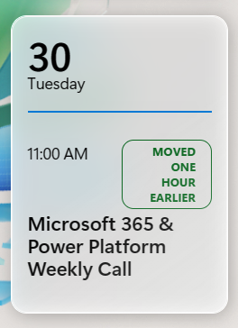

# PnP Team Website

## Outstanding work

- [ ] Dark theme
- [x] 404 page design
- [ ] Article page design
- [x] H1 use
- [x] Tweaks

## Changing content

This site will automatically update when you push to the `main` branch's `content` and `data` folders.

To prevent introducing potential issues, if you need to change anything other than the content or data, please create a new branch and submit a pull request.

> :warning: **Do not change the theme folder directly**
> Changes to the theme must be made in the [theme's repository](https://github.com/pnp/pnp-hugo-theme), which will automatically be included upon the next full build of this site.
>
> You can still override the theme's components by creating a `layouts` folder in the root of this repository and copying the file you want to change from the theme's `layouts` folder.

## Events

The events are automatically synced from the PnP shared calendar. You can move, cancel, or update events within the PnP calendar and they will automatically update on the website within 4 hours.

Labels like "Live", "Moved", "Canceled", and "Postponed" are automatically added to the event based on the event's status and/or start date.

You can also override a single event's status message by appending to the end of that one event's title. For example, if you have an event that is moved, you can change the event's individual occurrence's title from "Event Title" to "Event Title - Moved one hour earlier" to produce the following result:

Any additional events added to the calendar will appear in the upcoming events section, but not in the community calls section (which is reserved for regular community calls). Note that it assumes that all events are online Teams events. If you use the standard Teams event section in your description, the system will automatically extract the Teams link and add it to the ICS calendar.

> For some reason, Outlook's share calendar functionality doesn't export the join URL or HTML description; we extract the join URL from the plain text description, and we rebuild the HTML from the plain text description. So try not to mess with the Teams event section in the description -- other than changing the link to an aka.ms, of course.

Oh yeah, didn't I mention that? You can subscribe to the PnP calendar by adding `webcal://pnp.github.io/calendar.ics` to your calendar app, but that feature is still in beta.

We use the PnP calendar event's `UID` to reconcile the community calls section with the status from the PnP calendar. If you add a recurring community call to the content folder, make sure to specify the `UID` in the front matter. If you don't know the `UID`, you can find it in the ICS file.